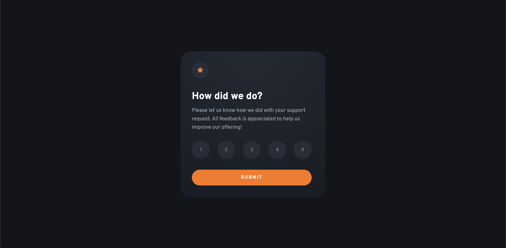

# Frontend Mentor - Interactive rating component solution

This is a solution to the [Interactive rating component challenge on Frontend Mentor](https://www.frontendmentor.io/challenges/interactive-rating-component-koxpeBUmI). Frontend Mentor challenges help you improve your coding skills by building realistic projects.

## Table of contents

- [Overview](#overview)
  - [The challenge](#the-challenge)
  - [Screenshot](#screenshot)
  - [Links](#links)
- [My process](#my-process)
  - [Built with](#built-with)
  - [What I learned](#what-i-learned)
  - [Continued development](#continued-development)
  - [Useful resources](#useful-resources)
- [Author](#author)

## Overview

### The challenge

Users should be able to:

- View the optimal layout for the app depending on their device's screen size
- See hover states for all interactive elements on the page
- Select and submit a number rating
- See the "Thank you" card state after submitting a rating

### Screenshot

### Links

- Solution URL: [https://www.frontendmentor.io/solutions/interactive-rating-component-using-html-css-and-js-2IeJrH5ZvO](https://www.frontendmentor.io/solutions/interactive-rating-component-using-html-css-and-js-2IeJrH5ZvO)
- Live Site URL: [brendanmadden.github.io/interactive-rating-component](https://brendanmadden.github.io/interactive-rating-component/)

## My process

### Built with

- JavaScript
- Semantic HTML5 markup
- CSS custom properties
- Flexbox
- CSS Grid
- Mobile-first workflow

### What I learned

I learned a lot during this project, and after a long break from coding it helped me to get a lot of my confidence back. I'm so thankful that I decided to take it on and challenge myself, and I'm really proud of my result.

I learned to solve problems with JavaScript event listeners that I had not experienced in the past, and I was able to effectively resolve all of the issues I ran into in a timely manner.

I learned a little bit more about proper use of semantic HTML throughout this project as well, although I would like to continue to improve in this area, as well as with regard to accessibility.

### Continued development

I've found that onne of the largest challenges I experience when starting a new project from scratch is determining the best layout structure, and the CSS to match it. I would like to continue to improve my layouts, and understanding of the most effective CSS to produce those layouts I'm looking to achieve.

I would also like to continue to learn more about proper use of semantic HTML, and I'm always looking to improve my HTML accessibility.

I'm currently focused on learning as much as I can about JavaScript, and I'm almost finished Jonas' course (referenced below). This is another area for continued development I'm focused on.

### Useful resources

- [Pixel to REM Converter](https://nekocalc.com/px-to-rem-converter) - This is a great resource I use on most projects for any conversions I might need.
- [Jonas' JavaScript Course](https://www.udemy.com/course/the-complete-javascript-course/) - This course in an unbelievable education in JavaScript and I would not have been able to build this project on my own without having taken it.

## Author

- GitHub - [Brendan Madden](https://github.com/brendanmadden)
- Frontend Mentor - [@brendanmadden](https://www.frontendmentor.io/profile/brendanmadden)
- Twitter - [@BrendanMadden\_](https://www.twitter.com/BrendanMadden_)
